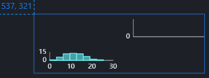
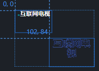
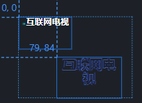
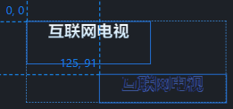
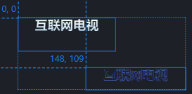
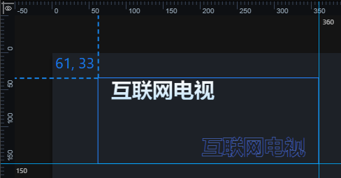
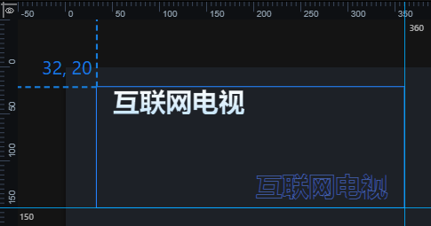
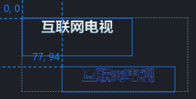
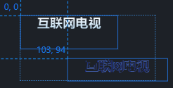

# 使用技巧-组相关属性操作

#### 组的位置

​		组的位置可通过配置栏调整，也可以在画布或者图层栏选中组，通过鼠标拖拽完成。

#### 组尺寸

组的高 = 组内所有组件上下边界极值差值

组的宽 = 组内所有组件左右边界极值差值

##### 1  影响组尺寸的因素

###### 1.1 在图上拖动调整组大小

 在平台中，如果想直接调整组的大小，唯一的方法是直接在图上拖动改变，但这样会导致组内所有组件比例的变化。以下是拖动前和拖动后的对比图。

###### 1.2 移动组内组件导致组尺寸变化

​		在平台中，组件的位置就是组件在组中的相对位置（当组件不处于任何组时，它属于背景画布组，本文不讨论）。当我们输入数值设置组件位置时，下列两种情况都**可能**导致组大小和位置的变化。

 1，组件移动后，组件范围超出组范围。

 2，组件移动前，仅该组件处于组边界。组件向内移动。

 例：下两图是组件移动前后坐标对比。符合第 2 点。

 其它的情况**均不会**导致组大小和位置的变化。

##### 2  控制组尺寸的方法

 我们可以通过合理设置组内组件的位置，来控制组尺寸。移动组件有两种方式：直接拖动和输入数值。

 1，拖动移动组件，移动后的组件符合上述情况时，组的大小**一定**会被改变。不再详述。

 2，输入数值移动组件，**可能**会导致组的大小变化。下面我们来说具体的控制方法。

###### 2.1 我们想改变组的尺寸

 在输入数值后，我们在左侧导航栏点击组内其它组件即可。系统会自动更新组内所有组件的相对位置和组的大小。以下是移动前和移动后的对比。

 如果我们的移动使组左边界或上边界发生改变，则组的位置也会改变。如下例。

 在移动前，组边界坐标如下图所示。

 我们将左上的组件向左上移动，发现组的大小和坐标也会改变，但右边界和下边界不变。效果如下图所示。

###### 2.2 我们不想改变组的尺寸

 在输入数值后，我们在左侧导航栏点击组即可。效果如下图所示。

 如果想将组件移出边界，也是一样的操作。效果如下图所示。

 通过这种方法，我们也可以将组内的组件位置设置为负数。此时组的位置和大小都不会改变。效果如下图所示。

