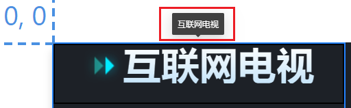

# 标题(label-text)

​		通用标题是文字组件的一种，支持自定义标题的内容、位置、颜色等，支持在可视化应用中添加多个通用标题组件，展示可视化应用和可视化应用中各个模块的标题。一般的纯文本都通过此组件展示。

## 一，配置项

### 1，组件基础配置项

| 配置项   | 说明                                                         |
| -------- | ------------------------------------------------------------ |
| 位置     | 组件在组内的位置                                             |
| 尺寸     | 组件尺寸                                                     |
| 角度     | 组件相对组件原点顺时针旋转角度。可通过两个图标，对组件进行x轴或y轴翻转 |
| 锁定图层 | 固定图层的位置和大小，防止误拖动。（可以通过直接赋值设置位置和尺寸） |
| 隐藏图层 | 将组件在画布上隐藏                                           |

### 2，文本配置项

| 配置项       | 说明                                   |
| ------------ | -------------------------------------- |
| 文本内容     | 显示的文本内容                         |
| 字号         | 设置文字大小                           |
| 字体颜色渐变 | 设置文字颜色从上到下的渐变             |
| 字体         | 文字字体                               |
| 字体粗细     | 字体粗细                               |
| 文字对齐方式 | 文字在组件中的水平位置（左/中/右对齐） |
| 文字排列方式 | 文字横向或纵向排列                     |
| 是否显示倒影 | 在文字下方显示文字和文字背景的倒影     |
| 是否显示阴影 | 在文字背后显示文字阴影                 |
| 是否显示描边 | 对文本进行描边                         |

### 3，背景配置项

- 是否使用渐变：背景颜色渐变（上下/左右/左上到右下）。

- 背景边框：在文本附近显示一圈矩形边框。

  | 边框样式     | 说明                     |
  | ------------ | ------------------------ |
  | 圆角         | 设置矩形边框四个角的圆角 |
  | 背景边框宽度 | 设置边框宽度             |
  | 背景边框线条 | 实线/虚线/点线           |

- 背景边框：在文本附近显示一圈矩形边框。

### 4，前缀配置项

​		不同的前缀图标类型，具有不同的配置项。

- 图标

  | 图标属性       | 说明                             |
  | -------------- | -------------------------------- |
  | 字号           | 图标大小                         |
  | 字体颜色       | 图标颜色                         |
  | 字体粗细       | （无）                           |
  | 图标外边距方向 | 设置图标外边距的方向             |
  | 图标外边距     | 设置图标和文字相对背景边框的边距 |

- 图片

  | 图片属性 | 说明                                     |
  | -------- | ---------------------------------------- |
  | 前缀图片 | 可以从本地图片或素材中心选取图片作为前缀 |
  | 图片尺寸 | 图片大小                                 |

### 5，气泡提示

​		气泡提示是指，当鼠标移动到组件上时，组件上方弹出文本气泡。如下图所示。

| 气泡属性 | 说明               |
| -------- | ------------------ |
| 气泡内容 | 气泡显示的内容     |
| 气泡位置 | 气泡相对组件的位置 |

## 二，组件可变数据来源

### 1，标题文本

​		标题文本有三个来源。以下三种来源优先级从高到低排列。

1. 从交互栏中订阅变量，以变量值作为标题。
2. 从数据栏中获取数据。
3. 从配置栏中设置固定标题文本。

### 2，（iconType）？

​		（这里的功能我没搞懂，是json数据中的iconType变量）

## 三，使用技巧

### 1，作为普通文本使用

​		我们使用标题组件，大多数情况下只是为了显示简单的文本信息。此时我们只需要关闭所有选项，如“字体颜色渐变”、“背景边框”、“前缀显示”、“气泡”等，即可作为普通文本使用。